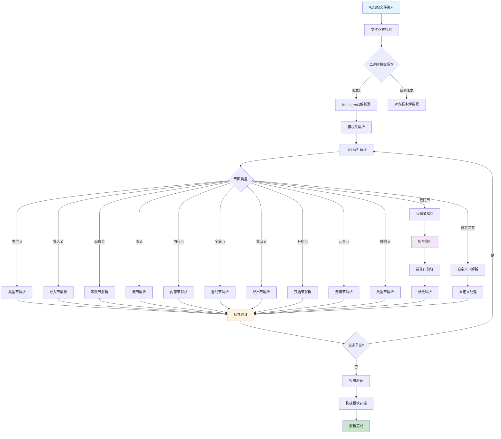

# UWVM2 WASM解析功能与COP面向概念模式分析

## 概述

UWVM2 (Ultimate WebAssembly Virtual Machine 2) 是一个基于C++26标准的高性能WebAssembly虚拟机，采用了创新的COP（Concept-Oriented Programming）面向概念编程模式来实现WASM解析功能。本文档将深入分析其技术架构和实现原理。

## 一、WASM解析功能架构

### 1.1 整体架构设计

UWVM2的WASM解析器采用了分层的概念导向架构：

```
概念层 (Concept Layer)
    ├── root概念 - 定义核心概念和扩展机制
    └── 特性概念 - 定义具体的WASM特性

二进制格式层 (Binary Format Layer)
    ├── binfmt_ver1 - WASM二进制格式版本1
    └── 其他版本支持

标准层 (Standard Layer)
    ├── WASM1 - WebAssembly 1.0标准
    ├── WASM1.1 - WebAssembly 1.1标准
    └── 其他标准版本

提案层 (Proposal Layer)
    ├── 多内存支持
    ├── SIMD指令集
    └── 其他实验性特性
```

### 1.2 核心组件结构

```
src/uwvm2/parser/wasm/
├── concepts/           # COP概念定义
│   ├── root.h         # 根概念定义
│   ├── operation.h    # 操作概念
│   └── feature_parameter.h # 特性参数
├── binfmt/            # 二进制格式解析
│   └── binfmt_ver1/   # 版本1格式
├── standard/          # 标准实现
│   ├── wasm1/         # WASM1标准
│   └── wasm2/         # WASM2标准
└── proposal/          # 提案实现
    ├── threads/       # 线程支持
    └── simd/          # SIMD支持
```

### 1.3 支持的WASM特性

根据features.md文档，UWVM2支持以下WASM特性：

| 特性 | 状态 | 参数 |
|------|------|------|
| MVP (WebAssembly 1.0) | ✅ V1.0.0 | 基础支持 |
| 批量内存操作 | ✅ V1.0.1 | 内置支持 |
| 多值返回 | ✅ V1.0.1 | 内置支持 |
| 可变全局变量 | ✅ V1.0.1 | 内置支持 |
| 引用类型 | ✅ V1.0.1 | 内置支持 |
| 多内存支持 | 🔧 | `--enable-multi-memory` |
| SIMD指令集 | 🔧 | `--enable-fixed-width-simd` |
| 线程和原子操作 | 🔧 | `--enable-thread` |
| 异常处理 | 🔧 | `--enable-exception-handling` |
| Memory64 | 🔧 | `--enable-memory64` |

## 二、COP面向概念编程模式

### 2.1 COP理论基础

COP（Concept-Oriented Programming）由Alexandr Savinov提出，是一种新的编程范式，旨在解决面向对象编程中对象表示和访问的问题。

#### 核心思想：
1. **概念优先设计**：整个架构围绕概念而非具体类型构建
2. **组合式扩展性**：特性可以组合和扩展而无需修改现有代码
3. **编译时验证**：广泛的编译时检查确保概念一致性
4. **关注点分离**：特性被隔离并可以独立开发

### 2.2 UWVM2中的COP实现

#### 2.2.1 根概念定义

```cpp
// src/uwvm2/parser/wasm/concepts/root.h
namespace uwvm2::parser::wasm::concepts {
    // 防止继承效应的特性保留类型
    template <typename FeatureType>
    struct feature_reserve_type_t {
        static_assert(::std::is_same_v<::std::remove_cvref_t<FeatureType>, FeatureType>,
                      "feature_reserve_type_t: typename 'FeatureType' cannot have refer and const attributes");
        explicit constexpr feature_reserve_type_t() noexcept = default;
    };

    // 二进制格式版本标识
    template <::uwvm2::parser::wasm::standard::wasm1::type::wasm_u32 Version>
    struct binfmt_version_t {
        explicit constexpr binfmt_version_t() noexcept = default;
    };

    // 特性名称检查概念
    template <typename FeatureType>
    concept has_feature_name = requires {
        requires ::std::same_as<::std::remove_cvref_t<decltype(::std::remove_cvref_t<FeatureType>::feature_name)>, 
                                ::uwvm2::utils::container::u8string_view>;
    };

    // WASM特性概念
    template <typename FeatureType>
    concept wasm_feature = has_feature_name<FeatureType> && 
                          has_wasm_binfmt_version<FeatureType> && 
                          ::std::is_empty_v<FeatureType>;
}
```

#### 2.2.2 操作概念实现

```cpp
// src/uwvm2/parser/wasm/concepts/operation.h
namespace uwvm2::parser::wasm::concepts::operation {
    // 获取二进制格式版本
    template <::uwvm2::parser::wasm::concepts::wasm_feature FeatureType>
    inline consteval ::uwvm2::parser::wasm::standard::wasm1::type::wasm_u32 
    get_binfmt_version() noexcept {
        constexpr auto binfmt_version = ::std::remove_cvref_t<FeatureType>::binfmt_version;
        static_assert(binfmt_version != 0);
        return binfmt_version;
    }

    // 检查重复的二进制格式处理函数
    template <::uwvm2::parser::wasm::concepts::wasm_feature... Fs>
    inline consteval void check_has_duplicate_binfmt_handler() noexcept {
        // 编译时检查逻辑...
    }
}
```

### 2.3 COP的优势

1. **类型安全**：通过C++概念在编译时确保类型正确性
2. **零成本抽象**：编译时多态，运行时无额外开销
3. **可扩展性**：新特性可以通过概念组合无缝添加
4. **模块化**：不同特性可以独立开发和测试

## 三、WASM解析流程

### 3.1 解析流程图



### 3.2 详细解析过程

#### 3.2.1 模块级解析

```cpp
// 模块存储结构
template <::uwvm2::parser::wasm::concepts::wasm_feature... Fs>
struct wasm_binfmt_ver1_module_extensible_storage_t {
    inline static constexpr ::uwvm2::parser::wasm::standard::wasm1::type::wasm_u32 binfmt_version{1u};
    
    ::uwvm2::parser::wasm::binfmt::module_span_t module_span{};
    ::uwvm2::parser::wasm::binfmt::ver1::splice_section_storage_structure_t<Fs...> sections{};
};
```

#### 3.2.2 节区解析策略

1. **类型安全的节区识别**
2. **特性感知的解析策略选择**
3. **可扩展的自定义节区处理**
4. **零拷贝的内存映射技术**

#### 3.2.3 指令解析流程

```
指令字节流 → 操作码解析 → 参数类型检查 → 特性兼容性验证 → 指令对象构建
```

### 3.3 错误处理机制

```cpp
// 错误处理基础设施
namespace uwvm2::parser::wasm::base {
    struct error_impl {
        // 错误代码和消息
        // 错误位置信息
        // 恢复策略
    };
}
```

## 四、特性扩展机制

### 4.1 特性参数系统

```cpp
template <typename... Fs>
struct feature_parameter_t {
    // 特性参数存储
    // 编译时特性组合验证
    // 运行时特性查询接口
};
```

### 4.2 ADL扩展点

通过参数依赖查找(ADL)提供类型安全的扩展点：

```cpp
// 自定义特性可以定义自己的解析策略
template <wasm_feature... Fs>
inline constexpr auto define_wasm_binfmt_parsering_strategy(
    feature_reserve_type_t<CustomFeature>,
    ::uwvm2::utils::container::tuple<Fs...>
) -> binfmt_handle_version_func_p_type<Fs...>;
```

### 4.3 编译时特性验证

```cpp
// 特性重复检查
template <::uwvm2::parser::wasm::concepts::wasm_feature... Fs>
inline consteval void check_has_duplicate_binfmt_handler() noexcept {
    // 编译时递归检查逻辑
    // 确保没有重复的特性定义
    // 验证特性依赖关系
}
```

## 五、性能优化策略

### 5.1 零拷贝解析

- 内存映射文件访问
- 原地解析技术
- 延迟求值策略

### 5.2 编译时优化

- 模板元编程优化
- 概念约束优化
- 内联展开优化

### 5.3 缓存策略

- 解析结果缓存
- 类型信息缓存
- 指令模板缓存

## 六、线程安全设计

### 6.1 不可变数据结构

- 解析后的模块数据不可变
- 线程间安全共享
- 无锁并发访问

### 6.2 重入性保证

- 所有解析函数都是重入的
- 无全局可变状态
- 线程本地错误处理

## 七、扩展性设计

### 7.1 新标准支持

```cpp
// 添加新的WASM标准版本
namespace uwvm2::parser::wasm::standard::wasm3 {
    // 新特性定义
    // 新节区类型
    // 新指令集
}
```

### 7.2 自定义特性

```cpp
// 用户自定义特性示例
struct custom_feature {
    inline static constexpr ::uwvm2::utils::container::u8string_view 
        feature_name{u8"custom_feature"};
    inline static constexpr ::uwvm2::parser::wasm::standard::wasm1::type::wasm_u32 
        binfmt_version{1u};
};
```

## 八、总结

UWVM2的WASM解析器通过创新的COP面向概念编程模式，实现了：

1. **高度模块化**的架构设计
2. **类型安全**的编译时验证
3. **零成本**的运行时性能
4. **可扩展**的特性系统
5. **线程安全**的并发处理

这种设计使得UWVM2能够灵活支持各种WASM标准和提案，同时保持高性能和可维护性。COP模式的应用为WebAssembly虚拟机的实现提供了新的思路和方法。

## 参考文献

1. Alexandr Savinov. "Concept-Oriented Programming: References, Classes and Inheritance Revisited." arXiv:1409.3947, 2014.
2. Alexandr Savinov. "Concept-oriented programming: from classes to concepts and from inheritance to inclusion." arXiv:1501.00720, 2015.
3. WebAssembly Specification. https://webassembly.github.io/spec/
4. UWVM2 Project Documentation. https://github.com/UlteSoft/uwvm2