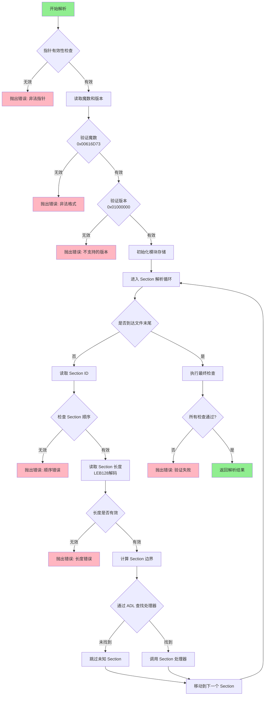
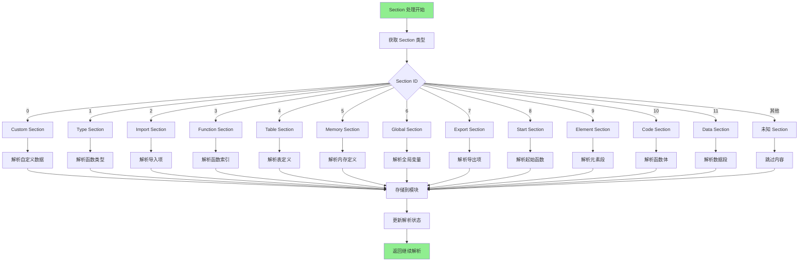
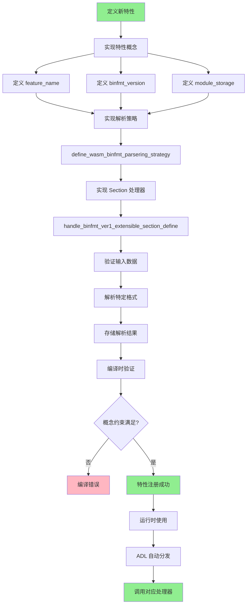

# UWVM2 WebAssembly 解析功能实现分析

## 目录
1. [概述](#概述)
2. [COP (Concept-Oriented Programming) 面向概念编程模式](#cop-面向概念编程模式)
3. [UWVM2 中的 COP 实现](#uwvm2-中的-cop-实现)
4. [WebAssembly 解析架构](#webassembly-解析架构)
5. [解析流程详解](#解析流程详解)
6. [流程图](#流程图)

## 概述

UWVM2 (Ultimate WebAssembly Virtual Machine Version 2) 是一个现代化的 WebAssembly 虚拟机实现，其 wasm 解析功能采用了创新的 COP（Concept-Oriented Programming，面向概念编程）模式，结合 C++26 的最新特性，实现了高度可扩展和类型安全的解析器架构。

### 主要特点
- **概念优先设计**：整个架构围绕概念而非具体类型构建
- **组合式可扩展性**：特性可以在不修改现有代码的情况下组合和扩展
- **编译时验证**：广泛的编译时检查确保概念一致性
- **关注点分离**：特性相互隔离，可以独立开发

## COP (Concept-Oriented Programming) 面向概念编程模式

### 什么是 COP？

COP 是由 Alexandr Savinov 提出的一种编程范式，它将"概念"作为程序设计的核心抽象单元。与传统的面向对象编程（OOP）不同，COP 强调：

1. **概念层次结构**：程序由层次化的概念组成，每个概念定义了一组约束和行为
2. **包含关系**：概念之间通过包含关系而非继承关系组织
3. **双重性质**：概念同时具有类型和实例的双重性质
4. **上下文依赖**：对象的行为依赖于其所在的概念上下文

### COP 的核心原则

1. **概念定义约束**：概念定义了类型必须满足的约束条件
2. **组合优于继承**：通过概念组合实现功能扩展
3. **编译时多态**：利用模板元编程实现编译时多态
4. **类型安全**：通过概念约束确保类型安全

## UWVM2 中的 COP 实现

UWVM2 巧妙地将 COP 理念与 C++ concepts 特性结合，创建了一个分层的、可扩展的 WebAssembly 解析架构。

### 1. 根层概念 (Root Layer Concepts)

```cpp
// 特性保留类型，防止 ADL 匹配时的继承效应
template <typename FeatureType>
struct feature_reserve_type_t {
    static_assert(std::is_same_v<std::remove_cvref_t<FeatureType>, FeatureType>,
                  "FeatureType cannot have refer and const attributes");
    explicit constexpr feature_reserve_type_t() noexcept = default;
};

// 用于 ADL 函数匹配的版本标记
template <wasm_u32 Version>
struct binfmt_version_t {
    explicit constexpr binfmt_version_t() noexcept = default;
};
```

### 2. 特性概念 (Feature Concepts)

```cpp
// 检查是否具有特性名称
template <typename FeatureType>
concept has_feature_name = requires {
    { FeatureType::feature_name } -> std::same_as<u8string_view const&>;
};

// 检查是否定义了二进制格式解析策略
template <typename FeatureType>
concept has_wasm_binfmt_parsering_strategy = requires {
    define_wasm_binfmt_parsering_strategy(
        feature_reserve_type<std::remove_cvref_t<FeatureType>>, 
        {/* tuple<Fs...> */}
    );
};

// WebAssembly 特性的完整概念定义
template <typename FeatureType>
concept wasm_feature = 
    has_feature_name<FeatureType> && 
    has_wasm_binfmt_version<FeatureType> &&
    has_wasm_binfmt_parsering_strategy<FeatureType>;
```

### 3. 操作概念 (Operation Concepts)

操作概念定义了如何在特性之间进行操作和组合：

```cpp
namespace operation {
    // 获取二进制格式版本
    template <wasm_feature FeatureType>
        requires (has_wasm_binfmt_version<FeatureType>)
    inline consteval wasm_u32 get_binfmt_version() noexcept {
        constexpr wasm_u32 binfmt_version{FeatureType::binfmt_version};
        static_assert(binfmt_version != 0);
        return binfmt_version;
    }
    
    // 检查重复的处理函数
    template <wasm_feature... Fs>
    inline consteval void check_has_duplicate_binfmt_handler() noexcept {
        // 编译时检查逻辑
    }
}
```

## WebAssembly 解析架构

### 分层架构设计

UWVM2 的 WebAssembly 解析器采用了清晰的分层架构：

```
┌─────────────────────────────────────────┐
│         应用层 (Application)            │
├─────────────────────────────────────────┤
│      特性层 (Features Layer)            │
│  ┌─────────┐ ┌─────────┐ ┌─────────┐  │
│  │ WASM1   │ │ WASM2   │ │ Custom  │  │
│  └─────────┘ └─────────┘ └─────────┘  │
├─────────────────────────────────────────┤
│      概念层 (Concepts Layer)            │
│  ┌─────────┐ ┌─────────┐ ┌─────────┐  │
│  │  Root   │ │Operation│ │Parameter│  │
│  └─────────┘ └─────────┘ └─────────┘  │
├─────────────────────────────────────────┤
│    二进制格式层 (Binary Format)         │
│  ┌─────────┐ ┌─────────┐ ┌─────────┐  │
│  │BinFmt V1│ │Sections │ │ Handler │  │
│  └─────────┘ └─────────┘ └─────────┘  │
├─────────────────────────────────────────┤
│       基础层 (Base Layer)               │
│  ┌─────────┐ ┌─────────┐ ┌─────────┐  │
│  │  Types  │ │  Error  │ │  Utils  │  │
│  └─────────┘ └─────────┘ └─────────┘  │
└─────────────────────────────────────────┘
```

### 主要组件说明

1. **基础层**：提供基本类型定义、错误处理和工具函数
2. **二进制格式层**：处理 WebAssembly 二进制格式的解析
3. **概念层**：定义核心概念和扩展机制
4. **特性层**：实现具体的 WebAssembly 标准版本
5. **应用层**：最终的解析器接口

## 解析流程详解

### 1. 模块验证和初始化

```cpp
[[nodiscard]] inline constexpr wasm_binfmt_ver1_module_extensible_storage_t<Fs...> 
wasm_binfmt_ver1_handle_func(
    std::byte const* const module_begin,
    std::byte const* const module_end,
    error_impl& err,
    feature_parameter_t<Fs...> const& fs_para) 
{
    // 1. 指针有效性检查
    if(module_begin > module_end) {
        // 抛出错误：非法的起始指针
    }
    
    // 2. 魔数验证 (0x00 0x61 0x73 0x6D)
    if(!is_wasm_file_unchecked(module_curr)) {
        // 抛出错误：非法的 wasm 文件格式
    }
    
    // 3. 版本验证 (0x01 0x00 0x00 0x00)
    // 版本由用户选择或自动检测
}
```

### 2. Section 解析循环

```cpp
do {
    // 1. 读取 section ID
    wasm_byte sec_id;
    std::memcpy(&sec_id, module_curr, sizeof(wasm_byte));
    
    // 2. 检查 section 顺序（除了 custom section）
    if(sec_id != 0u && sec_id < max_section_id) {
        // 抛出错误：无效的 section 规范顺序
    }
    
    // 3. 读取 section 长度（LEB128 编码）
    wasm_u32 sec_len;
    auto [next, err] = parse_by_scan(module_curr, module_end, 
                                     leb128_get(sec_len));
    
    // 4. 调用相应的 section 处理器
    handle_section(sec_id, section_begin, section_end, ...);
    
} while(module_curr != module_end);
```

### 3. Section 处理分发

通过 ADL (Argument Dependent Lookup) 和概念约束，自动分发到正确的处理函数：

```cpp
template<typename Sec, typename... Fs>
concept has_handle_binfmt_ver1_extensible_section_define = 
    requires(feature_reserve_type_t<Sec> ref,
             wasm_binfmt_ver1_module_extensible_storage_t<Fs...>& storage,
             /* ... */) {
        {
            handle_binfmt_ver1_extensible_section_define(
                ref, storage, section_begin, section_end, err, fs_para, sec_id_ptr)
        } -> std::same_as<void>;
    };
```

### 4. 特性扩展机制

新特性可以通过定义相应的概念和处理函数来扩展：

```cpp
// 定义新特性
struct my_wasm_extension {
    inline static constexpr u8string_view feature_name{u8"my_extension"};
    inline static constexpr wasm_u32 binfmt_version{1};
    
    // 定义 section 存储
    template<typename... Fs>
    using module_storage_define = tuple<
        type_section_storage_t,
        my_custom_section_storage_t<Fs...>
    >;
};

// 定义解析策略
template<wasm_feature... Fs>
inline constexpr auto define_wasm_binfmt_parsering_strategy(
    feature_reserve_type_t<my_wasm_extension>,
    tuple<Fs...>) noexcept {
    return my_custom_handler<Fs...>;
}
```

## 流程图

### WebAssembly 模块解析总体流程



### Section 处理详细流程



### COP 概念扩展流程



## 优势总结

1. **高度可扩展**：通过 COP 模式，新的 WebAssembly 特性可以在不修改现有代码的情况下添加
2. **类型安全**：编译时概念检查确保所有扩展都满足必要的约束
3. **性能优异**：模板元编程和编译时多态避免了运行时开销
4. **清晰的架构**：分层设计使得代码组织清晰，易于理解和维护
5. **标准兼容**：支持 WebAssembly 1.0、2.0 等多个版本，并可轻松扩展到未来版本

## 结论

UWVM2 通过创新性地将 COP 编程范式与 C++ 现代特性结合，创建了一个既灵活又高效的 WebAssembly 解析器架构。这种设计不仅展示了概念编程的强大威力，也为其他需要高度可扩展性的系统设计提供了有价值的参考。