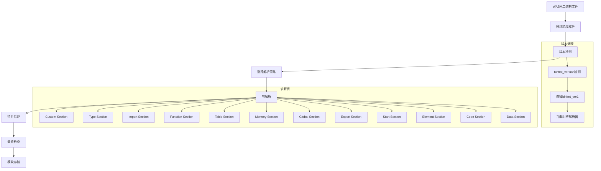
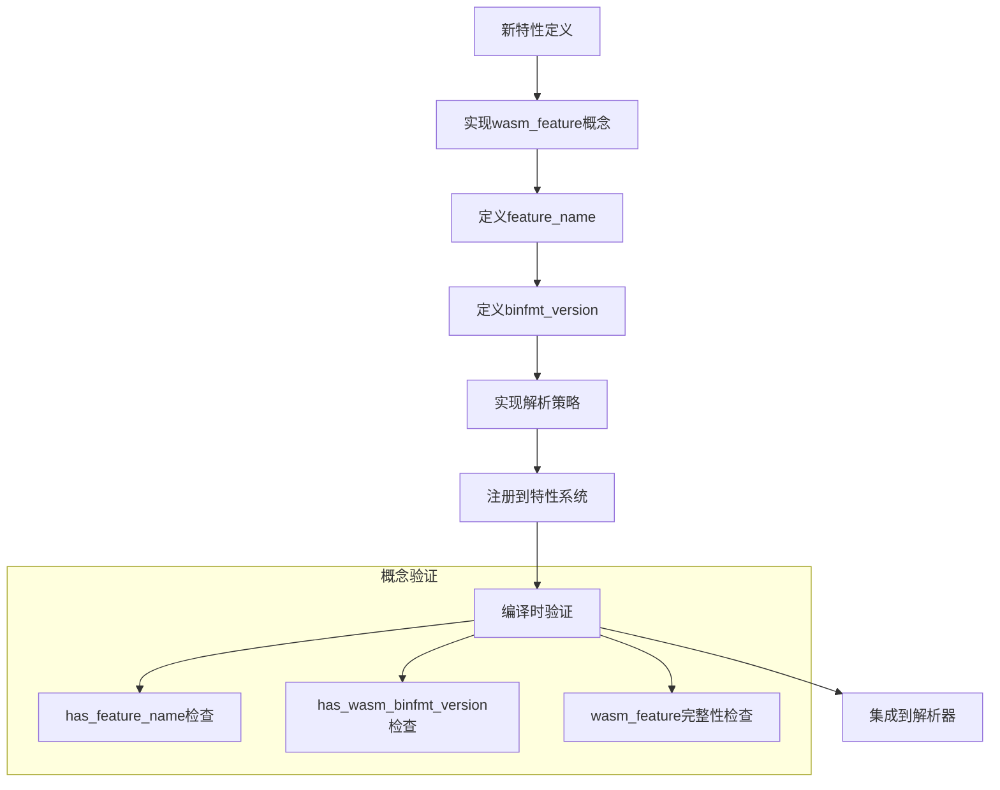

# uwvm2 WASM解析功能架构与COP面向概念模式

## 1. 概述

uwvm2（Ultimate WebAssembly Virtual Machine 2）采用基于**COP（Concept-Oriented Programming）面向概念编程**的架构设计，通过C++ concepts和特性驱动的方式实现WASM解析功能。

## 2. COP面向概念模式

### 2.1 核心设计原则

- **概念优先设计（Concept-First Design）**：整个架构围绕概念而非具体类型构建
- **组合式扩展性（Compositional Extensibility）**：特性可以组合和扩展，无需修改现有代码
- **编译时验证（Compile-time Verification）**：通过广泛的编译时检查确保概念一致性
- **关注点分离（Separation of Concerns）**：特性相互隔离，可以独立开发

### 2.2 架构层次结构

```
concept:                         root (concept)
                                      |
                         ____________/ \______________
                        /                             \
binfmt:           binfmt_ver1(binfmt1)                ...
                 /       |        |    \
features:       wasm1    wasm1.1  wasm2  ... (standard, proposal)
```

### 2.3 核心概念定义

#### 2.3.1 基础概念（root.h）

```cpp
// 特性名称概念
template <typename FeatureType>
concept has_feature_name = requires {
    requires ::std::same_as<::std::remove_cvref_t<decltype(::std::remove_cvref_t<FeatureType>::feature_name)>, 
                           ::uwvm2::utils::container::u8string_view>;
};

// WASM二进制格式版本概念
template <typename FeatureType>
concept has_wasm_binfmt_version = requires {
    requires ::std::same_as<::std::remove_cvref_t<decltype(::std::remove_cvref_t<FeatureType>::binfmt_version)>,
                           ::uwvm2::parser::wasm::standard::wasm1::type::wasm_u32>;
};

// WASM特性概念
template <typename FeatureType>
concept wasm_feature = has_feature_name<FeatureType> && 
                      has_wasm_binfmt_version<FeatureType> && 
                      ::std::is_empty_v<FeatureType>;
```

#### 2.3.2 操作概念（operation.h）

```cpp
// 获取二进制格式版本
template <::uwvm2::parser::wasm::concepts::wasm_feature FeatureType>
    requires (::uwvm2::parser::wasm::concepts::has_wasm_binfmt_version<FeatureType>)
inline consteval ::uwvm2::parser::wasm::standard::wasm1::type::wasm_u32 get_binfmt_version() noexcept
{
    constexpr ::uwvm2::parser::wasm::standard::wasm1::type::wasm_u32 binfmt_version{
        ::std::remove_cvref_t<FeatureType>::binfmt_version};
    static_assert(binfmt_version != 0);
    return binfmt_version;
}
```

## 3. WASM解析功能实现

### 3.1 解析器架构

#### 3.1.1 目录结构
```
src/uwvm2/parser/wasm/
├── concepts/           # 核心概念定义
│   ├── root.h         # 基础概念
│   ├── operation.h    # 操作概念
│   └── readme.md      # 概念说明
├── binfmt/            # 二进制格式解析
│   └── binfmt_ver1/   # WASM v1二进制格式
├── standard/          # WASM标准实现
│   ├── wasm1/         # WASM 1.0标准
│   ├── wasm1p1/       # WASM 1.1标准
│   └── wasm2/         # WASM 2.0标准
├── proposal/          # WASM提案实现
└── feature/           # 特性支持
```

#### 3.1.2 核心组件

1. **概念层（Concepts Layer）**
   - 定义WASM解析的基础概念和约束
   - 提供类型安全的扩展机制
   - 支持编译时验证

2. **二进制格式层（Binary Format Layer）**
   - 处理不同版本的WASM二进制格式
   - 提供版本特定的解析策略
   - 支持零拷贝技术

3. **特性层（Features Layer）**
   - 实现具体的WASM特性
   - 支持组合和扩展
   - 提供类型安全的接口

### 3.2 解析流程

#### 3.2.1 模块解析流程



#### 3.2.2 特性扩展流程



### 3.3 关键实现细节

#### 3.3.1 模块存储结构

```cpp
template <::uwvm2::parser::wasm::concepts::wasm_feature... Fs>
struct wasm_binfmt_ver1_module_extensible_storage_t
{
    inline static constexpr ::uwvm2::parser::wasm::standard::wasm1::type::wasm_u32 binfmt_version{1u};
    
    ::uwvm2::parser::wasm::binfmt::module_span_t module_span{};
    ::uwvm2::parser::wasm::binfmt::ver1::splice_section_storage_structure_t<Fs...> sections{};
};
```

#### 3.3.2 特性定义示例

```cpp
struct wasm1
{
    inline static constexpr ::uwvm2::utils::container::u8string_view feature_name{
        u8"WebAssembly Release 1.0 (2019-07-20)"};
    inline static constexpr ::uwvm2::parser::wasm::standard::wasm1::type::wasm_u32 binfmt_version{1u};
    
    // 类型定义
    using value_type = ::uwvm2::parser::wasm::concepts::operation::type_replacer<
        ::uwvm2::parser::wasm::concepts::operation::root_of_replacement,
        ::uwvm2::parser::wasm::standard::wasm1::type::value_type>;
    
    // 节类型定义
    template <::uwvm2::parser::wasm::concepts::wasm_feature... Fs>
    using binfmt_ver1_section_type = ::uwvm2::utils::container::tuple<
        ::uwvm2::parser::wasm::standard::wasm1::features::custom_section_storage_t,
        ::uwvm2::parser::wasm::standard::wasm1::features::type_section_storage_t<Fs...>,
        // ... 其他节类型
    >;
};
```

## 4. 扩展机制

### 4.1 ADL（Argument Dependent Lookup）扩展

通过ADL机制提供类型安全的扩展点：

```cpp
template <typename... Fs>
concept has_handle_binfmt_ver1_extensible_section_define =
    requires(::uwvm2::parser::wasm::concepts::feature_reserve_type_t<::std::remove_cvref_t<Sec>> ref,
             ::uwvm2::parser::wasm::binfmt::ver1::wasm_binfmt_ver1_module_extensible_storage_t<Fs...>& module_storage,
             ::std::byte const* const section_begin,
             ::std::byte const* const section_end,
             ::uwvm2::parser::wasm::base::error_impl& err,
             ::uwvm2::parser::wasm::concepts::feature_parameter_t<Fs...> const& fs_para,
             ::std::byte const* const sec_id_module_ptr) {
        {
            handle_binfmt_ver1_extensible_section_define(ref, module_storage, section_begin, section_end, err, fs_para, sec_id_module_ptr)
        } -> ::std::same_as<void>;
    };
```

### 4.2 模板元编程扩展

通过模板元编程实现编译时特性组合：

```cpp
template <::uwvm2::parser::wasm::concepts::wasm_feature... Fs>
inline consteval auto get_binfmt_handler_func_p_from_tuple(::uwvm2::utils::container::tuple<Fs...>) noexcept
{
    return ::uwvm2::parser::wasm::concepts::operation::get_binfmt_handle_version_func_p_type_from_tuple(
        ::uwvm2::utils::container::tuple<Fs...>{});
}
```

## 5. 优势与特点

### 5.1 设计优势

1. **类型安全**：通过C++ concepts确保编译时类型安全
2. **零拷贝**：使用模块跨度技术实现零拷贝解析
3. **可扩展性**：支持新特性的无缝集成
4. **性能优化**：编译时优化和模板元编程
5. **标准兼容**：完整支持WASM标准

### 5.2 技术特点

1. **概念驱动**：基于概念而非具体实现
2. **组合式设计**：特性可以自由组合
3. **编译时验证**：大量编译时检查
4. **模板元编程**：充分利用C++模板系统
5. **ADL扩展**：类型安全的扩展机制

## 6. 总结

uwvm2的WASM解析功能通过COP面向概念模式实现了一个高度可扩展、类型安全、性能优异的解析器。其核心优势在于：

- **概念优先的设计理念**确保了架构的清晰性和可维护性
- **组合式扩展机制**使得新特性的集成变得简单和安全
- **编译时验证**大大减少了运行时错误的可能性
- **零拷贝技术**提供了优异的性能表现

这种设计使得uwvm2能够轻松支持WASM标准的演进和新特性的添加，同时保持代码的清晰性和可维护性。