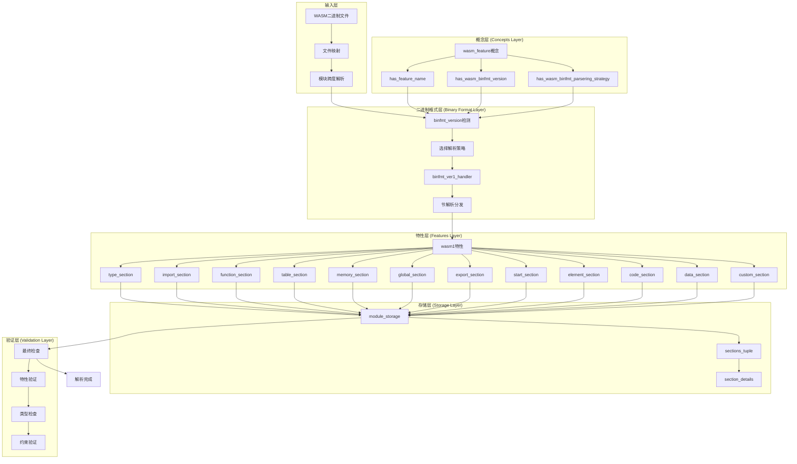
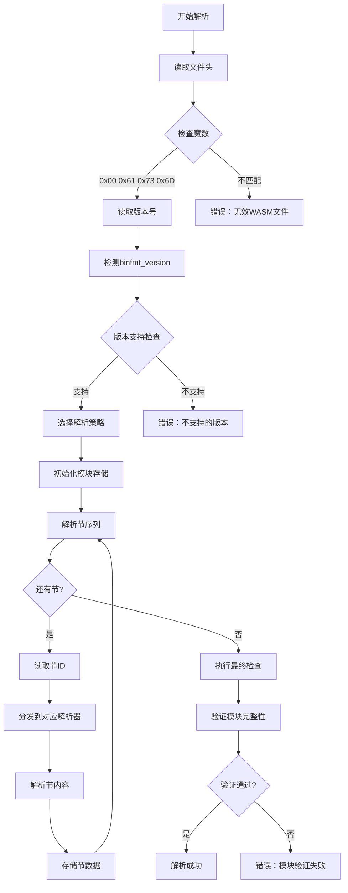
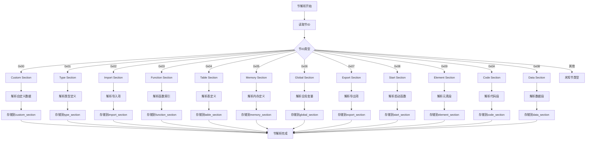
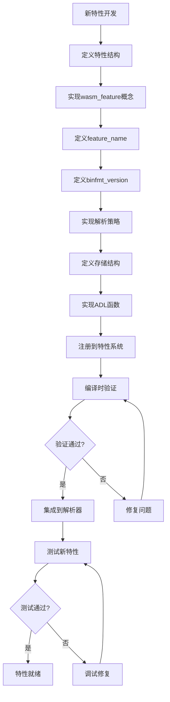
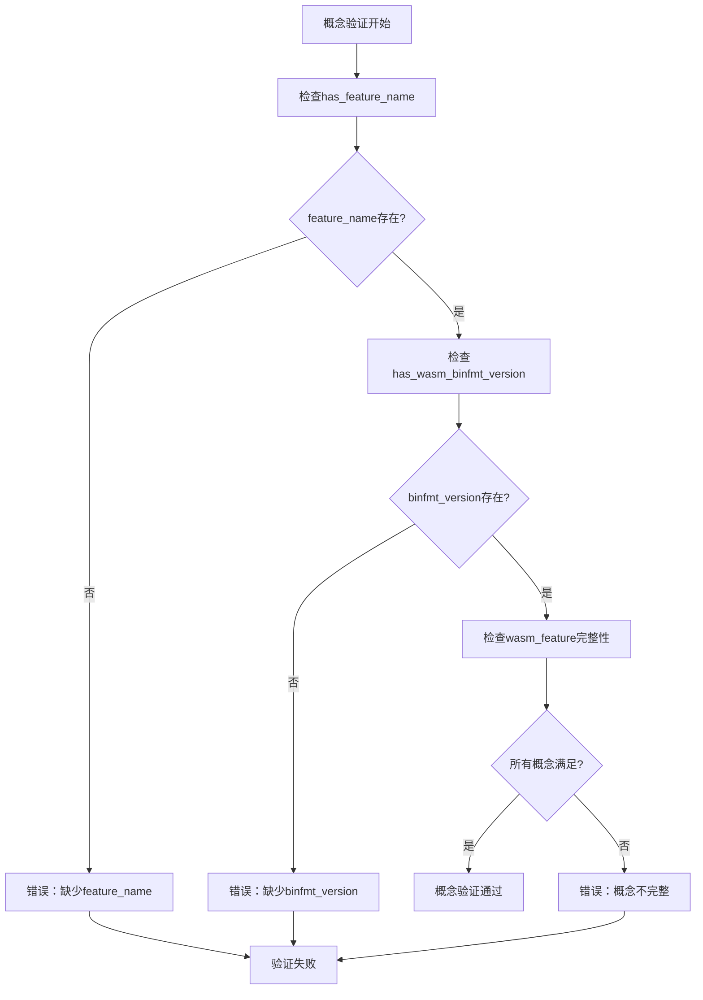
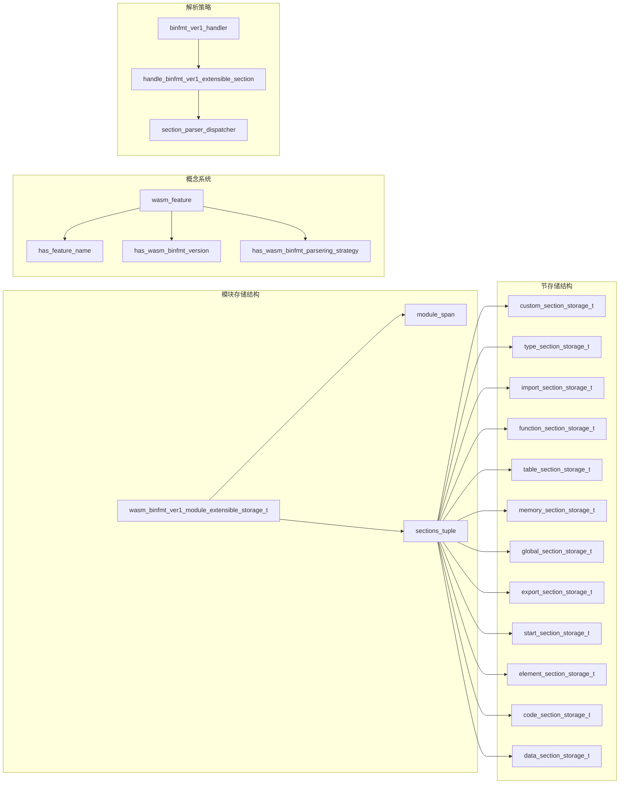
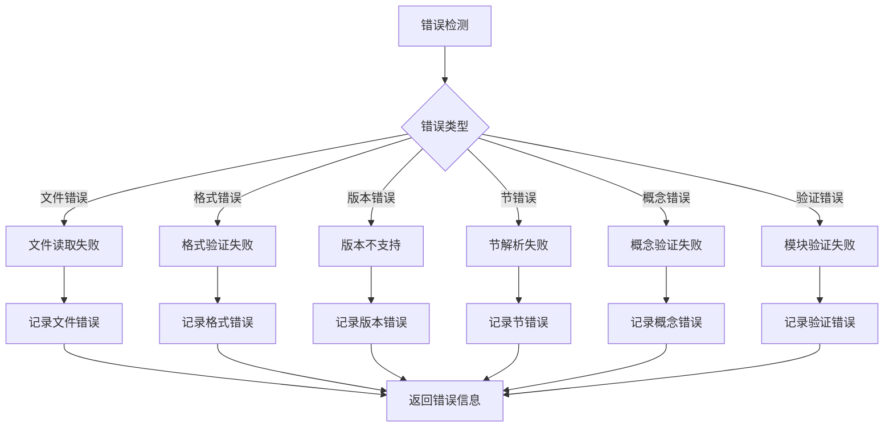
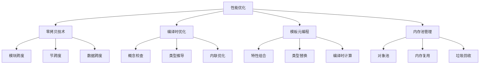

# uwvm2 WASM解析功能完整流程图

## 1. 整体架构流程图

## 2. 详细解析流程图

### 2.1 模块解析主流程

### 2.2 节解析详细流程

### 2.3 特性扩展流程

### 2.4 概念验证流程

## 3. 关键数据结构关系图

## 4. 错误处理流程

## 5. 性能优化策略

这个完整的流程图展示了uwvm2 WASM解析功能的各个层面和关键流程，从概念定义到具体实现，从错误处理到性能优化，形成了一个完整的解析系统。